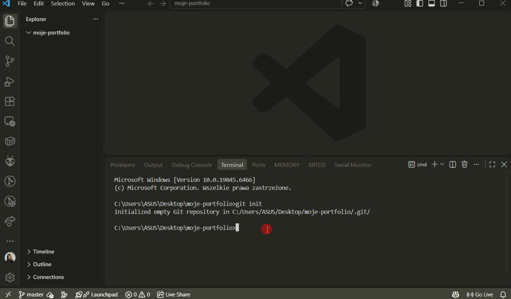

# Lesson 1: Introduction to Pelican

- [Pelican docs](https://docs.getpelican.com/en/latest/)

## Opening our `moje-portfolio` project

Alternatively, we can create a new one:

```
mkdir -p ~/projects/pelican-portfolio
cd ~/projects/pelican-portfolio
git init
```

## Installing the library

```bash
python -m pip install "pelican[markdown]"
```

## Initializing the project

```
pelican-quickstart
```

## Adding the first post

Create a file named `my-post.md` in the `content` folder.

Paste the sample post content (or create your own):

```markdown
Title: My super title
Date: 2010-12-03 10:20
Modified: 2010-12-05 19:30
Category: Python
Tags: pelican, publishing
Slug: my-super-post
Authors: Alexis Metaireau, Conan Doyle
Summary: Short version for index and feeds

This is the content of my super blog post.
```

For convenience, we previously installed Pelican with the `markdown` extension. This allows us to create posts in the Markdown format. Another available format is reStructuredText. ## Building the site

```
pelican content
```

## Running the site locally

```
pelican --listen
```

## Step-by-step video



## Example

- [pelican-sandbox](https://github.com/MartaSien/pelican-sandbox) – I created this sample site to demonstrate how you can start building a portfolio.

## Pelican themes

We can customize the site's appearance using [themes](https://docs.getpelican.com/en/latest/pelican-themes.html).

### Cloning the themes repository

```
git clone --recursive https://github.com/getpelican/pelican-themes ~/pelican-themes
```

### Changing the default site theme

The path can be absolute or relative to the `pelicanconf.py` file.

```
THEME = "themes/martin-pelican"
```

### Rebuilding and running the site

```
pelican content
pelican --listen
```